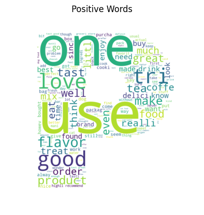
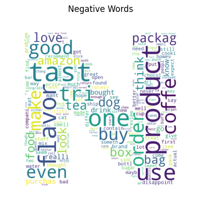
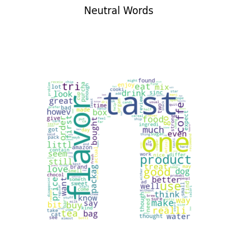
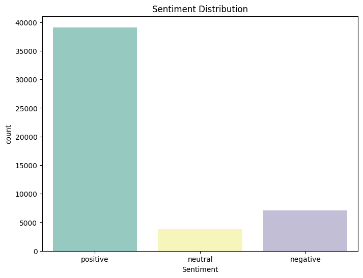
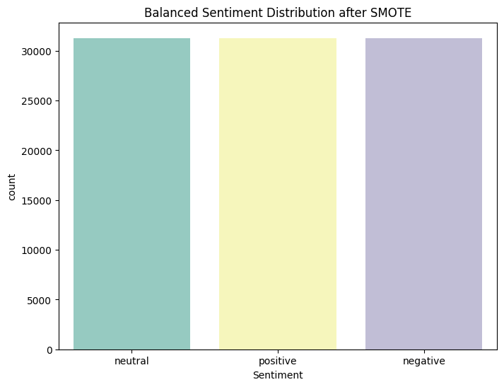

### Sentiment Analysis for Enhanced Business Intelligence

<table>
  <tr>
    <td></td>
    <td></td>
    <td></td>
  </tr>
</table>

### Business Insights and Applications:

**Strategic Business Decision:**

The **insights** derived from the **sentiment analysis** can help businesses understand **customer** sentiments, allowing them to make **informed and strategic** business decisions.

**Product Development:**

Direct contributions to the product development process can be made by incorporating the insights derived from negative and neutral reviews, focusing on the areas that need improvement.

**Customer Service Enhancement:**

Understanding customer sentiments can help in improving customer service by addressing the concerns and preferences of the customers, which are reflected in the reviews.

**Marketing Strategies Integration:**

The findings from the sentiment analysis can be integrated into marketing strategies by leveraging positive reviews for promotions and addressing the concerns mentioned in negative reviews to enhance product appeal.

**Sales Forecasting:**

Positive and negative sentiments can influence sales forecasting by helping to understand customer purchasing behavior and preferences, thus allowing more accurate and customer-oriented product placements and offerings.

**Model and Evaluation**

- **Logistic Regression - 77.69% Accuracy**
- **Random Forest Classifier - 82.57% Accuracy**
- **Naive Bayes - 71.26% Accuracy**
- **Recurrent Neural Network - 77% Accuracy**
- **Epoch-wise Accuracy**

- **Epoch 1:**
    - Training Accuracy: 78.18%
    - Validation Accuracy: 78.30%
- **Epoch 2:**
    - Training Accuracy: 78.79%
    - Validation Accuracy: 78.04%
- **Epoch 3:**
    - Training Accuracy: 79.52%
    - Validation Accuracy: 77.88%
- **Epoch 4:**
    - Training Accuracy: 79.82%
    - Validation Accuracy: 77.47%
- **Epoch 5:**
    - Training Accuracy: 79.92%
    - Validation Accuracy: 77.54%

**Vader - 76.69% Accuracy**

## Objective:

To see if sentiment analysis of Amazon product reviews might offer useful information for making strategic business decisions.

To determine whether suggestions for business strategies can be gleaned from the sentiment analysis of customer evaluations.

To investigate how insights from sentiment analysis might improve marketing, sales forecasting, customer service and product development.

## Dataset

The dataset consisted of product reviews, each labeled with a score indicating the sentiment of the review. a score above 3 was considered positive, below 3 was considered negative and a score of 3 was neutral.

| Column                 | Non-Null Count | Dtype |
|------------------------|----------------|-------|
| Id                     | 568454         | int64 |
| ProductId              | 568454         | object|
| UserId                 | 568454         | object|
| ProfileName            | 568428         | object|
| HelpfulnessNumerator   | 568454         | int64 |
| HelpfulnessDenominator | 568454         | int64 |
| Score                  | 568454         | int64 |
| Time                   | 568454         | int64 |
| Summary                | 568427         | object|
| Text                   | 568454         | object|

## Methodology

**Data Pre-processing**

The **raw** text data was **preprocessed** by removing **HTML** tags, converting to lowercase, tokenizing, removing stopwords and performing stemming and lemmatization.

**Exploratory Data Analysis**

Visualised the initial **distribution** of **sentiments** and generated **WordClouds** for each sentiment class after **preprocessing** the text.

**Data Balancing**

Employed **SMOTE** to handle **class imbalance** in the dataset.

**Model Training and Evaluation** 

Multiple models were trained and evaluated on the processed dataset using **accuracy** and **classification report**.

**Logistic Regression**

|            | Precision | Recall | F1-Score | Support |
|------------|-----------|--------|----------|---------|
| Negative   | 0.57      | 0.67   | 0.62     | 1421    |
| Neutral    | 0.23      | 0.43   | 0.30     | 758     |
| Positive   | 0.94      | 0.83   | 0.88     | 7821    |
|------------|-----------|--------|----------|---------|
| Accuracy   |           |        | 0.7769   | 10000   |
| Macro Avg  | 0.58      | 0.64   | 0.60     | 10000   |
| Weighted Avg | 0.83    | 0.78   | 0.80     | 10000   |

#### Insights
- **Accuracy**: 77.69%
- Logistic Regression model provided a decent accuracy and fared well in classifying positive sentiments but struggled more with neutral and negative classes, particularly with precision in the neutral class.

**Random Forest Classifier**

|            | Precision | Recall | F1-Score | Support |
|------------|-----------|--------|----------|---------|
| Negative   | 0.64      | 0.49   | 0.56     | 1421    |
| Neutral    | 0.47      | 0.17   | 0.25     | 758     |
| Positive   | 0.86      | 0.95   | 0.90     | 7821    |
|------------|-----------|--------|----------|---------|
| Accuracy   |           |        | 0.8257   | 10000   |
| Macro Avg  | 0.66      | 0.54   | 0.57     | 10000   |
| Weighted Avg | 0.80    | 0.83   | 0.80     | 10000   |

#### Insights
- **Accuracy**: 82.57%
- The Random Forest model yielded the highest accuracy among the models and demonstrated a substantial ability to classify positive sentiments, but it had lower recall for the negative and neutral classes.

**Naive Bayes**

|            | Precision | Recall | F1-Score | Support |
|------------|-----------|--------|----------|---------|
| Negative   | 0.51      | 0.64   | 0.57     | 1421    |
| Neutral    | 0.18      | 0.48   | 0.26     | 758     |
| Positive   | 0.94      | 0.75   | 0.83     | 7821    |
|------------|-----------|--------|----------|---------|
| Accuracy   |           |        | 0.7126   | 10000   |
| Macro Avg  | 0.54      | 0.62   | 0.56     | 10000   |
| Weighted Avg | 0.82    | 0.71   | 0.75     | 10000   |

#### Insights
- **Accuracy**: 71.26%
- The Naive Bayes model, while having the lowest accuracy, showed a balanced recall among the classes, notably performing well in identifying neutral sentiments which other models struggled with.

**Recurrent Neural Network (RNN)**

| Epoch | Training Accuracy | Validation Accuracy |
|-------|-------------------|---------------------|
| 1     | 78.18%            | 78.30%              |
| 2     | 78.79%            | 78.04%              |
| 3     | 79.52%            | 77.88%              |
| 4     | 79.82%            | 77.47%              |
| 5     | 79.92%            | 77.54%              |

#### Insights
- The RNN model gradually improved its training accuracy over epochs but had a slight decrease in validation accuracy, suggesting possible overfitting to the training data. Nonetheless, it managed to achieve around 77% accuracy on unseen data, showing its potential efficacy in sentiment classification tasks involving sequential data.

**Vader**

|            | Precision | Recall | F1-Score | Support |
|------------|-----------|--------|----------|---------|
| Negative   | 0.49      | 0.24   | 0.32     | 1421    |
| Neutral    | 0.11      | 0.05   | 0.07     | 758     |
| Positive   | 0.82      | 0.93   | 0.87     | 7821    |
|------------|-----------|--------|----------|---------|
| Accuracy   |           |        | 0.7679   | 10000   |
| Macro Avg  | 0.47      | 0.41   | 0.42     | 10000   |
| Weighted Avg | 0.72    | 0.77   | 0.73     | 10000   |

#### Insights
- **Accuracy**: 76.79%
- Vader performed reasonably well in accuracy, excelling particularly at classifying positive sentiments. However, it showed limitations in precisely identifying neutral and negative sentiments, possibly due to its reliance on a predefined lexicon and inherent challenges in interpreting the contextual meaning of words.

